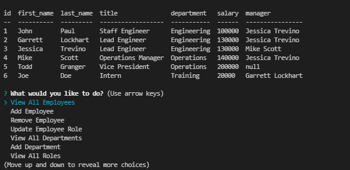

# SQL: Employee Tracker

## Purpose

The purpose of this project was to create a Command Line Interface application for a user to track their employees. It allows them to create roles and departments as well as add employees to the team with those new roles.   

Some features of the site are:
- The user is able to view all current employees, departments, and roles.
- The user is able to add roles, departments, and employees to the database.
- The user is able to change roles that an employee has. 

Here is a short video displaying the application functionality: https://youtu.be/JPDCfV4Z2LU

---

## Appearance

### Here is an example of the application with some team members added:  

